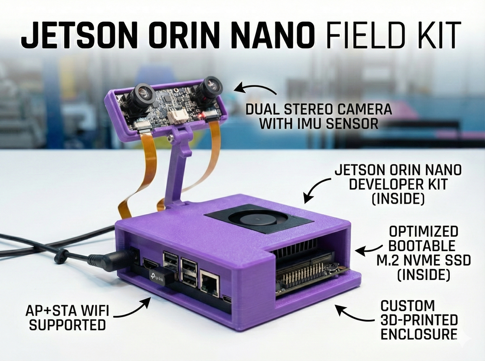
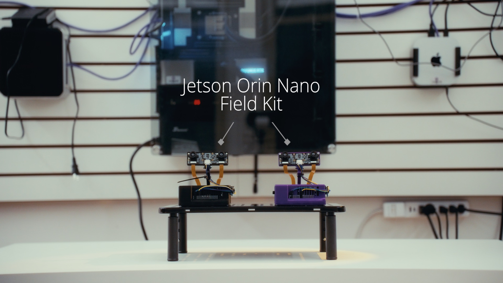

<h1 align="center"><strong>Jetson Orin Nano Field Kit</strong></h1>

<p align="center">
  Optimized, ready-to-boot prototyping stack for the Jetson Orin Nano to save many hours of setup<br>
</p>

<p align="center">
  
  
</p>

<p align="center">
  <a href="#getting-started">Get Started</a> ·
  <a href="https://shop.implyinfer.com">How to Purchase</a> ·
  <a href="https://implyinfer.com/docs">Documentation</a> ·
  <a href="#contributing">Contributing</a>
</p>

## TL;DR

<div align="center">

| **Production-Ready Hardware** | **Optimized Software Stack** |
| :--- | :--- |
| ✅ **Dual Stereo IMX219** (160° FOV) |  **Built on JetPack 6.2.1** |
| ✅ **Bootable NVMe SSD** (Pre-flashed) | **10+ vision, language, and speech models preinstalled** |
| ✅ **AC600 WiFi** (AP + Station Mode) |  **Low-Latency MediaMTX Streaming** |
| ✅ **Custom Case** (Rigid Camera Mount) |  **PyTorch, TensorRT, OpenCV, CTranslate2, Llamacpp, Whisper Pre-built for Cuda 12.6** |

[**Download Latest OS Image**](https://github.com/implyinfer/jetson-orin-nano-field-kit/releases/latest)

<br/>
<br/>

<p><strong>Official Community Hardware Partner</strong></p>

<p><strong>Free Annual Core Plan</strong> ($900 Value) with every Field Kit purchase.<br>
<em>Available until Jan 31st, 2026</em></p>


</div>
---

<p align="center">
  
</p>
<p align="center">
  
  
  
</p>

## Overview

Building computer vision, LLMs, voice apps, etc on the Jetson Orin Nano is incredible, but getting it configured and production-ready can be a nightmare. 

To stop repeating this process for every experiment, I built a custom OS image and hardware setup. It saved me and friends weeks of dev time, so I decided to polish it up and open source it.

From loading an OS image onto a microSD (or M.2 NVMe ssd), getting everything configured, getting the device tree to play nice with specific cameras, making it boot reliably from an NVMe SSD (so it’s actually fast), and compiling what felt like endless libraries just to use CUDA 12.6 properly. Plus all the troubleshooting along the way takes hundreds of hours.

This repository contains the application software stack for the Jetson Orin Nano Field Kit, an out of the box configured jetson orin nano developer kit setup. The kit provides dual IMX219 cameras and pre-installed AI tools for offline deployment on top of what's already provided on the jetson orin nano.

**[Read the Full Documentation at implyinfer.com/docs](https://implyinfer.com/docs)**

### Hardware in the Kit
-   ✅ **Jetson Orin Nano Super**: The powerful edge AI compute module.
-   ✅ **Dual Stereo IMX219 Cameras**: 160° FOV, pre-configured for depth/SLAM.
-   ✅ **256GB NVMe SSD**: Bootable, fast I/O, pre-flashed with our custom image.
-   ✅ **AC600 USB Wifi**: Supports simultaneous AP + Station modes (Hotspot + Internet).
-   ✅ **Custom Case**: Protects the board and holds cameras rigid for stable calibration.

### Software Stack
It runs a fully open source custom **JetPack 6.2.1** image that is maintained and updated frequently.

-   **Ready to Run**: Docker, Livekit, Ollama, Llama.cpp, Roboflow Inference Server, 10+ vision/language models pre-installed.
-   **Optimized for CUDA 12.6**: Pre-compiled TensorRT, PyTorch, OpenCV (with GStreamer/V4L2 support), CTranslate, Cusparselt, etc.
-   **Connectivity**: Configured for low-latency MediaMTX camera streams and AP + STA WiFi mode.

## Zero to Hero Guide

Watch this video for a visual walkthrough of the first boot process and getting started with your Field Kit:

- **Zero to Hero Guide (Docs)**: https://www.implyinfer.com/docs/zero-to-hero
- **Zero to Hero Video**: https://youtu.be/H8-wf09d_XQ
- **Launch Video**: https://youtu.be/rB8F3yZPCGM

[](https://youtu.be/H8-wf09d_XQ)

## Latest Release (v2.1 - 2025-12-19)

The latest system image is included in all Jetson Orin Nano Field Kits. It provides a complete out-of-the-box experience with all services pre-installed and configured.

- **Download Image**: [jetson_backup_95gb_2025-12-19.img.zst](https://dash.cloudflare.com/4435cb1ab70e01358f0ee8fa306fa2f5/r2/default/buckets/implyinfer/objects/release-images%252Fjetson_backup_95gb_2025-12-19.img.zst/details?prefix=release-images%2F)
- **Flashing Guide**: [NVMe Flashing Guide](https://github.com/implyinfer/jetson-orin-nano-field-kit/blob/release-v1/FLASH_NVME.md)

### Release Highlights
- **First Boot Demo**: Instant vision system demo on port 5000 (`http://box.local` or `http://localhost:5000`).
- **Roboflow Inference Server**: GPU-accelerated object detection with offline model caching.
- **MediaMTX Streaming**: Ultra low-latency RTSP/RTMP camera streaming.
- **Large Language Models**: Open WebUI with Ollama and pre-loaded models (`qwen3:1.7b`, `ministral-3:3b`).
- **WiFi Hotspot**: Creates `JetsonFieldKit` AP for easy configuration.

## Self Setup (DIY Guide)

You can build your own Field Kit using the open source software and hardware designs.

### 1. Hardware Requirements
- **Jetson Orin Nano Developer Kit** (8GB RAM recommended)
- **NVMe SSD** (256GB+ required, 512GB+ recommended)
- **Dual IMX219 Cameras** (e.g., Arducam 8MP Stereo HAT or 2x Raspberry Pi Camera V2)
- **USB WiFi Adapter** (RTL8811AU/RTL8821AU chipset for AP mode support, e.g. BrosTrend AC600)

### 2. Download & Flash OS Image
1.  **Download the latest image**: [Releases](https://github.com/implyinfer/jetson-orin-nano-field-kit/releases/latest)
2.  **Flash to NVMe**: Follow the **[NVMe Flashing Guide](FLASH_NVME.md)**.
    > ⚠️ **Note**: The system must be booted from NVMe. MicroSD cards are too slow for these AI workloads.

### 3. 3D Print the Case
We provide the STL files for the custom rugged case and rigid camera mount.
- **[Download STL Files](https://github.com/implyinfer/jetson-orin-nano-field-kit/tree/main/hardware/case)** (Placeholder link)
- **Recommended Material**: PETG or ABS for heat resistance.
- **Assembly Guide**: [Assembly Instructions](https://implyinfer.com/docs/assembly) (Placeholder link)

### 4. Camera Setup
The image is pre-configured for dual IMX219 cameras.
1.  Connect cameras to CSI ports (Cam 0 = Left, Cam 1 = Right).
2.  Boot the system.
3.  Verify streams at `http://box.local:8888/cam0` and `http://box.local:8888/cam1`.

### Managing Services (Custom Hardware)
If you are using different hardware (different WiFi adapter, no cameras, etc.), you can disable specific services to save resources:

#### WiFi Hotspot
If you don't have the specific AC600 adapter, disable the hotspot service:
```bash
sudo systemctl disable --now hotspot.service
```

#### Camera Streaming
If you don't have cameras connected, disable the streaming service:
```bash
sudo systemctl disable --now mediamtx.service
```

#### Other Optional Services
To free up resources, you can disable other pre-installed services:
- **Offline Wikipedia:** `sudo systemctl disable --now kiwix.service`
- **Voice Assistant:** `sudo systemctl disable --now livekit.service`
- **Roboflow Inference:** `sudo systemctl disable --now roboflow.service`

## Getting Started

### 1. First Boot & Connection
The system automatically creates a WiFi hotspot for easy access:

1.  **Connect to WiFi**: Look for the network **`JetsonFieldKit`**
    -   **Password**: `fieldkit123`
2.  **Access the Device**:
    -   **Hostname**: `http://box.local`
    -   **Hotspot IP**: `http://10.42.0.1`
    -   **LAN IP**: `http://<192.168.x.x>` (if connected to Ethernet)

### 2. Default Credentials

| Service | Username | Password |
|---------|----------|----------|
| **System User** | `box` | `box` |
| **WiFi Hotspot** | SSID: `JetsonFieldKit` | `fieldkit123` |

> **Security Note**: Change the default system password immediately after first login using the `passwd` command.

## Features & Guides

Once connected, you can explore the various capabilities of the Field Kit. Check out our [full documentation](https://implyinfer.com/docs) for detailed guides.

### 👁️ Computer Vision
Real-time object detection using Roboflow inference and IMU sensor data.
- **[Read the Guide](https://implyinfer.com/docs/computer-vision-with-roboflow)**
- **Demo**: `http://box.local`

### 🧠 Large Language Models
Run LLMs locally without cloud dependencies. Includes Open WebUI.
- **[Read the Guide](https://implyinfer.com/docs/llms)**
- **Access**: `http://box.local/webui/`

### 🗣️ Voice Assistant
Wake word-enabled voice assistant with tool calling and offline capabilities.
- **[Read the Guide](https://implyinfer.com/docs/voice-assistant)**

## System Reference

### Service Ports

| Port | Service | Description |
|------|---------|-------------|
| **80** | Nginx | Main Web Interface (Roboflow Stream + WebUI) |
| **5000** | Roboflow Stream | Internal Stream Port (Proxied to 80) |
| **8001** | Kiwix | Offline Wikipedia |
| **8554** | MediaMTX RTSP | Camera RTSP streams |
| **8888** | MediaMTX HLS | Camera HLS streams |
| **8889** | MediaMTX WebRTC | Camera WebRTC streams |
| **9001** | Inference API | GPU inference API |
| **3000** | Open WebUI | LLM Chat (Proxied to 80/webui) |

### Camera Streaming
Streams are available via MediaMTX:
- **RTSP**: `rtsp://<IP>:8554/cam0` (Left) & `rtsp://<IP>:8554/cam1` (Right)
- **Web Browser**: `http://<IP>:8888/cam0`

## Development

This is a monorepo built with Turborepo.

### Installation

```bash
# Clone the repository
git clone https://github.com/implyinfer/jetson-orin-nano-field-kit.git
cd jetson-orin-nano-field-kit

# Install dependencies
npm install -g pnpm@9.0.0
pnpm install

# Provision services (on Jetson)
cd system
sudo bash provision.sh
```

### Build Commands

```bash
pnpm build        # Run all builds
pnpm lint         # Run all linters
pnpm check-types  # Run type checking
pnpm format       # Format code
```

## Contributing

Contributions are welcome!
1. Fork the repository
2. Create a feature branch
3. Submit a pull request

## License

See [LICENSE](LICENSE) file for license information.
