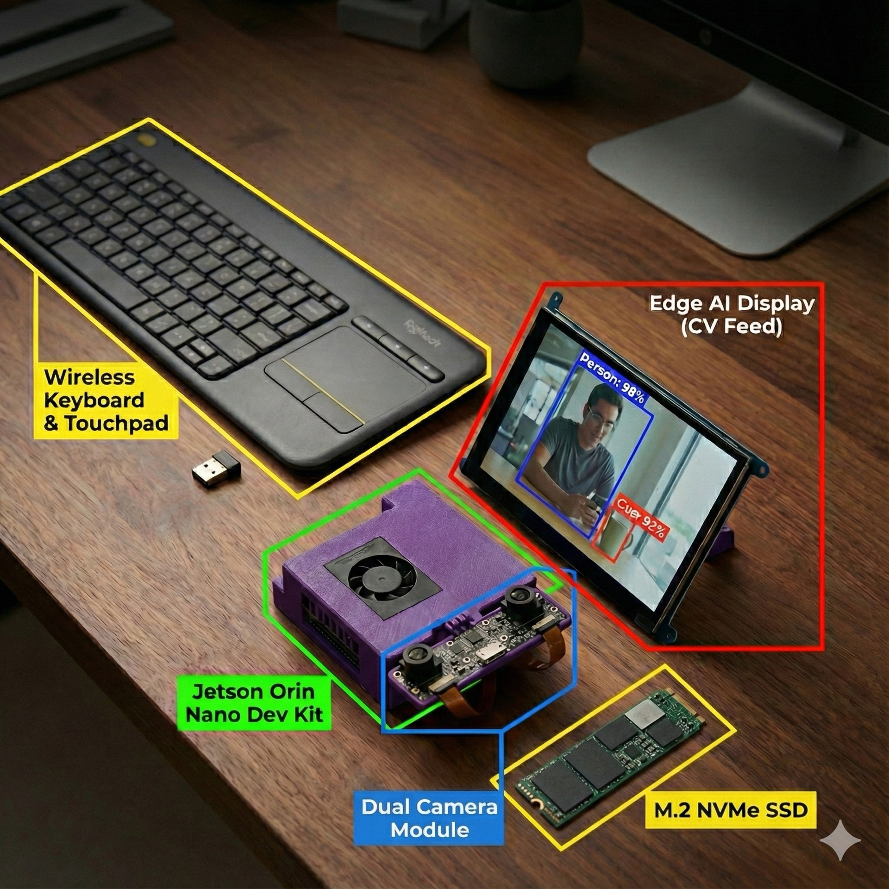
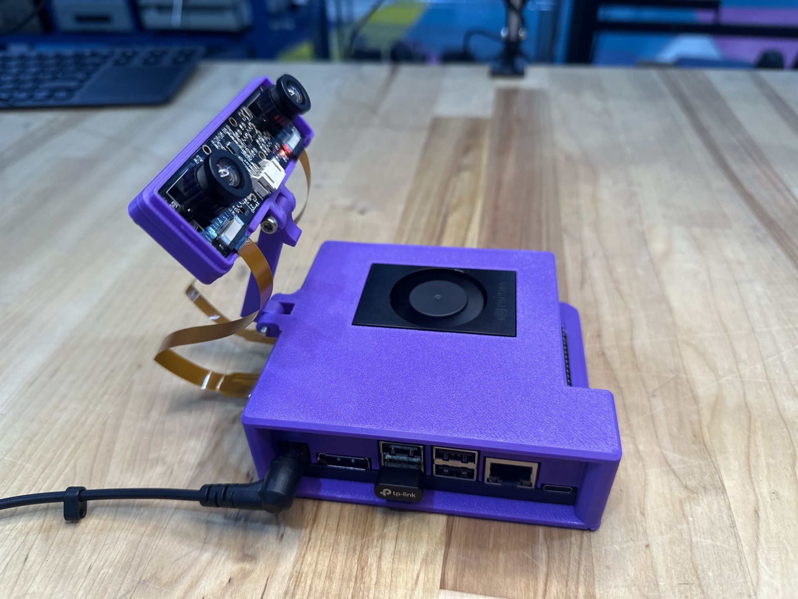
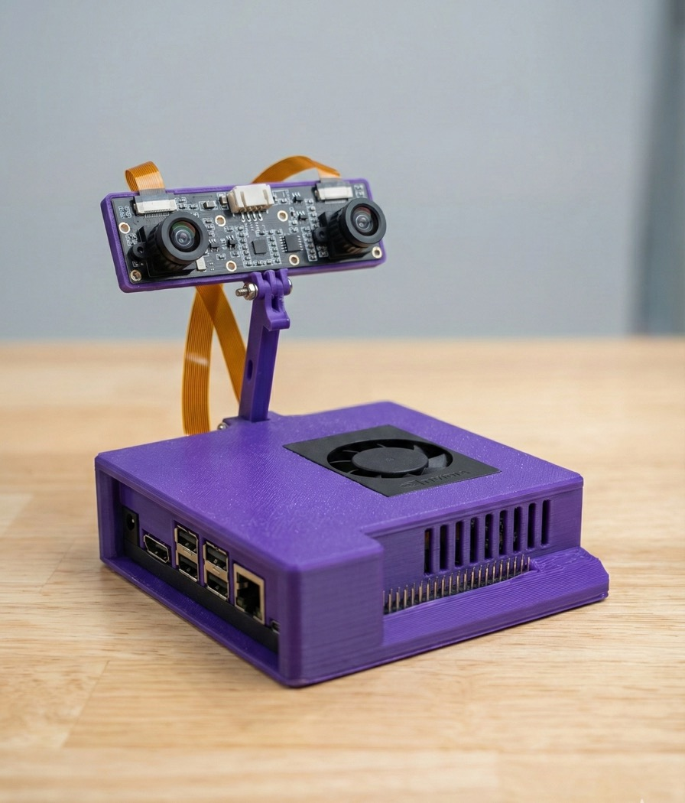
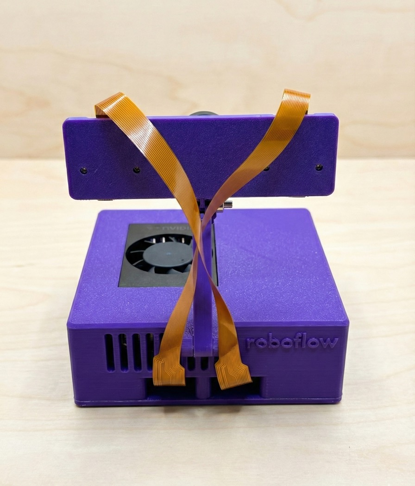

<h1 align="center"><strong>Jetson Orin Nano Field Kit</strong></h1>

<p align="center">
Open source application layer for the Jetson Orin Nano Field Kit.<br>
AI-powered vision and voice applications optimized for edge deployment.
</p>

<p align="center">
<a href="#overview">About</a> ·
<a href="https://www.implyinfer.com/jetson-field-kit">How to Purchase</a> ·
<a href="#quick-start">Get Started</a> ·
<a href="#documentation">Documentation</a> ·
<a href="#contributing">Contributing</a>
</p>

---

<p align="center">
  
  
</p>
<p align="center">
  
  
</p>

## Overview

This repository contains the application software stack for the Jetson Orin Nano Field Kit, an out of the box configured jetson orin nano developer kit setup. The kit provides dual IMX219 cameras and pre-installed AI tools for offline deployment on top of what's already provided on the jetson orin nano.

This application layer is designed to work with the Jetson Orin Nano system image.

## Latest Release (v2 - 2025-12-19)

The latest system image is included in all Jetson Orin Nano Field Kits. It provides a complete out-of-the-box experience with all services pre-installed and configured.

- **Download Image**: [jetson_backup_95gb_2025-12-19.img.zst](https://dash.cloudflare.com/4435cb1ab70e01358f0ee8fa306fa2f5/r2/default/buckets/implyinfer/objects/release-images%252Fjetson_backup_95gb_2025-12-19.img.zst/details?prefix=release-images%2F)
- **Flashing Guide**: [NVMe Flashing Guide](https://github.com/implyinfer/jetson-orin-nano-field-kit/blob/release-v1/FLASH_NVME.md)

### Release Highlights

- **First Boot Demo**: Instant vision system demo on port 5000 (`http://box.local` or `http://localhost:5000`), showing `rfdetr-small` running live object detection immediately after boot.
- **Roboflow Inference Server**: Hardened Docker container with GPU acceleration (TensorRT/CUDA) and offline model caching. API on port 9001.
- **MediaMTX Streaming**: Pre-configured systemd service for RTSP/RTMP camera streaming.
- **Large Language Models**: Open WebUI with Ollama runtime and pre-loaded models (`qwen3:1.7b`, `ministral-3:3b`) optimized for Orin Nano.
- **Development Tools**: Claude Code Editor installed for on-device development.
- **Connectivity**: Firefox browser (Snap) and USB WiFi adapter support (8821cu) for flexible networking.
- **System Services**:
  - **Roboflow Vision Service**: Auto-starts inference server and web stream.
  - **WiFi Hotspot Service**: Creates `JetsonFieldKit` AP for easy configuration.

## Features

- **Dual Camera RTSP/WebRTC Streaming** - Ultra low-latency video streaming via MediaMTX
- **Roboflow Local Inference** - GPU-accelerated object detection with pre-downloaded models and 9-DOF IMU integration
- **WiFi Hotspot (AP+STA)** - Automatically creates a "JetsonFieldKit" hotspot while maintaining internet connection
- **Web-based Monitoring** - Browser-accessible video streams with real-time inference overlays and sensor data
- **Voice Assistant** - Wake word-enabled assistant with tool calling and offline knowledge base

## Quick Start

### 1. Provision System Services

The kit comes with a provisioning script that sets up all necessary systemd services (MediaMTX, Roboflow, Kiwix, Hotspot, etc.).

```bash
cd system
sudo bash provision.sh
```

This will install and start:
- **MediaMTX** (Streaming Server)
- **Roboflow Inference Server** & **Web Stream**
- **WiFi Hotspot**
- **Kiwix** (Offline Wiki)
- **Open WebUI** (Ollama Frontend)

### 2. Connect to WiFi Hotspot

The system automatically creates a WiFi hotspot for easy access:

- **SSID**: `JetsonFieldKit`
- **Password**: `fieldkit123`
- **Gateway IP**: `10.42.0.1`

You can access the device using:
- **Hostname**: `http://box.local` (Mac/Windows/Linux with mDNS)
- **Hotspot IP**: `http://10.42.0.1`
- **LAN IP**: `http://<192.168.x.x>` (if connected to another WiFi network)

### 3. Access Web Interface

Open your browser to:

- **Roboflow Stream**: `http://box.local/` or `http://10.42.0.1/` (Real-time inference visualization)
- **Open WebUI**: `http://box.local/webui/` or `http://10.42.0.1/webui/` (LLM Chat)
- **Kiwix**: `http://box.local:8001` or `http://10.42.0.1:8001` (Offline Knowledge Base)

## Architecture

This is a monorepo built with Turborepo, containing multiple applications and shared packages:

### Applications

- **Vision** (`apps/vision/roboflow`) - Real-time object detection using Roboflow inference and IMU sensor data
- **Voice Assistant** (`apps/voice-assistant`) - Wake word-enabled voice assistant with tool calling, Linux command execution, and offline knowledge base integration
- **Docs** (`apps/docs`) - Documentation site built with Next.js

### System Services

System-level services configured for the Jetson Orin Nano:

- **Hotspot** (`system/hotspot`) - AP+STA WiFi hotspot configuration
- **MediaMTX** (`system/mediamtx`) - RTSP streaming server for IMX219 camera modules
- **Nginx** (`system/nginx`) - Reverse proxy for web services
- **LiveKit** (`system/livekit`) - Real-time communication infrastructure for voice assistant
- **Kiwix** (`system/kiwix`) - Offline Wikipedia and knowledge base server
- **Roboflow** (`system/roboflow`) - Docker service for Roboflow inference server and web stream
- **Ultralytics** (`system/ultralytics`) - YOLO model inference service

### Shared Packages

- `packages/ui` - Shared UI components
- `packages/eslint-config` - Shared ESLint configurations
- `packages/typescript-config` - Shared TypeScript configurations

## Camera Streaming (MediaMTX)

The system uses MediaMTX for reliable, low-latency camera streaming with three protocols:

- **RTSP** (port 8554) - Best for programmatic access and VLC
- **HLS** (port 8888) - Works in any web browser
- **WebRTC** (port 8889) - Ultra low-latency web viewing

### Stream Configuration

Camera streams are configured in `system/mediamtx/mediamtx.yml` with optimized scripts:
- `system/mediamtx/start_cam0.sh` - Left stereo camera (sensor-id=0)
- `system/mediamtx/start_cam1.sh` - Right stereo camera (sensor-id=1)

Both stereo cameras stream at **1280x720 @ 30fps** with ultra low-latency encoding optimizations.

### Viewing Streams

**VLC Player:**
```bash
vlc rtsp://<JETSON_IP>:8554/cam0
```

**Web Browser:**
Open `http://<JETSON_IP>:8888/cam0` or `http://<JETSON_IP>:8889/cam0`

For detailed setup instructions, see [RTSP_SETUP.md](RTSP_SETUP.md).

## Roboflow Inference & Vision

The kit includes GPU-accelerated object detection using Roboflow's inference server with locally cached models, integrated with a 9-DOF IMU (ICM20948) for orientation tracking.

### Web Stream with IMU

The system runs a web stream service (`roboflow-web-stream.service`) that provides:
1. Real-time video stream from the camera
2. Object detection bounding boxes and labels
3. 3D visualization of the device orientation using IMU data

Access it at `http://<JETSON_IP>/`.

### Download Models (One-time Setup)

Pre-download models for offline inference:

```bash
cd apps/vision/roboflow
source venv/bin/activate
python download_models.py
```

**Available Models:**

| Model | Description |
|-------|-------------|
| `yolov11n-640` | YOLOv11 Nano - Fast, lightweight |
| `rfdetr-small` | RF-DETR Small - High accuracy |
| `yolov8n-640` | YOLOv8 Nano - Fast |

## Installation

### System Image Setup

Before using this application layer, ensure you have:

1. **Downloaded the latest release image** (see [Latest Release](#latest-release-v2---2025-12-19) section above)
2. **Flashed the Jetson Orin Nano with the system image** - See [NVMe Flashing Guide](https://github.com/implyinfer/jetson-orin-nano-field-kit/blob/release-v1/FLASH_NVME.md) for complete instructions on flashing the image to an NVMe SSD
3. Completed the initial setup using instructions from [implyinfer-jetson-orin-nano-field-kit-notes](https://github.com/implyinfer/implyinfer-jetson-orin-nano-field-kit-notes)

### 1. Clone the Repository

```bash
git clone https://github.com/implyinfer/implyinfer-jetson-orin-nano-field-kit.git
cd implyinfer-jetson-orin-nano-field-kit
```

### 2. Install Dependencies

```bash
# Install pnpm if not already installed
npm install -g pnpm@9.0.0

# Install project dependencies
pnpm install
```

### 3. Provision Services

```bash
# Provision all system services
cd system
sudo bash provision.sh
```

This will set up all services including MediaMTX, Roboflow, Kiwix, and the WiFi Hotspot.

## Service Ports Summary

| Port | Service | Description |
|------|---------|-------------|
| 80 | Nginx | Main Web Interface (Roboflow Stream + WebUI) |
| 5000 | Roboflow Web Stream | Internal Stream Port (Proxied to 80) |
| 8001 | Kiwix | Offline Wikipedia |
| 8554 | MediaMTX RTSP | Camera RTSP streams |
| 8888 | MediaMTX HLS | Camera HLS streams |
| 8889 | MediaMTX WebRTC | Camera WebRTC streams |
| 9001 | Roboflow Inference | GPU inference API |
| 3000 | Open WebUI | LLM Chat (Proxied to 80/webui) |

## Development

### Monorepo Commands

```bash
# Run all builds
pnpm build

# Run all linters
pnpm lint

# Run type checking
pnpm check-types

# Format code
pnpm format
```

### Code Style

- JavaScript/TypeScript: Follows Standard.js rules (2 spaces, no semicolons, single quotes)
- Python: Follows PEP 8 conventions
- Use functional and declarative programming patterns
- Prefer composition over inheritance

## Requirements

- NVIDIA Jetson Orin Nano Developer Kit
- JetPack 6.2
- Dual Stereo IMX219 camera module
- Docker and Docker Compose
- WiFi Adapter (for Hotspot AP mode)

## Documentation

- [NVMe Flashing Guide](FLASH_NVME.md) - Complete instructions for flashing the system image to an NVMe SSD
- [RTSP Setup Guide](RTSP_SETUP.md) - Complete RTSP streaming setup

## Contributing

This is an open source project. Contributions are welcome. Please:

1. Fork the repository
2. Create a feature branch
3. Make your changes following the code style guidelines
4. Submit a pull request

## License

See LICENSE file for license information.
